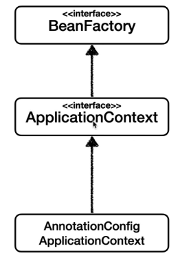

1. ##### 스프링 빈 조회

   1. Type으로 조회하기

      ```java
      AnnotationConfigApplicationContext ac = new AnnotationConfigApplicationContext(SameBeanConfig.class);
      
      Map<String, MemberRepository> t = ac.getBeansOfType(MemberRepository.class);
      for (String key : t.keySet()) {
      	System.out.println(key + ", " + t.get(key));
      }
      ```

   2. 상속관계

      - 부모 타입으로 조회하면, 자식 타입도 함께 조회한다.
      - 그래서 Object 타입으로 조회하면 모든 스프링 빈을 조회한다.

2. ##### BeanFactory

   
   
   - 스프링 컨테이너의 최상위 인터페이스
   - 스프링 빈을 관리하고 조회하는 역할
   - getBean을 제공
   
3. ##### ApplicationContext

   - MessageSource
     - 메시지소스를 활용한 국제화 기능
   - EnvironmentCapable
     - 환경변수
     - 로컬환경/개발환경/운영환경 등을 구분해서 처리
   - ApplicationEventPublisher
     - 애플리케이션 이벤트
     - 이벤트를 발행하고 구독하는 모델을 편리하게 지원
   - ResourceLoader
     - 편리한 리소스 조회
     - 파일, 클래스 패스, 외부 등에서 리소스를 편리하게 조회
   - 스프링 빈 관리
     - ApplicationContext는 BeanFactory의 기능을 상속받는다.

4. ##### 스프링 빈 설정 메타 정보 : BeanDefinition

   1. 스프링은 xml, groovy, java등 다양한 설정 형식을 지원하는데 그 중심에는 BeanDefinition이라는 추상화가 있기 때문에 스프링 컨테이너에 동일한 동작을 담을 수 있는 것이다.

   2. 추상화에만 의존하도록 잘 설계되어있음

      

5. ##### 조회 빈이 2개 이상일 때

   1. @Autowired는 타입으로 조회하기 때문에, 같은 타입의 빈이 2개 이상일 때 문제가 발생한다.

   2. NoUniqueBeanDefinitionException

      ```java
      Caused by: org.springframework.beans.factory.NoUniqueBeanDefinitionException: No qualifying bean of type 'com.example.demo.discount.DiscountPolicy' available: expected single matching bean but found 2: fixDiscountPolicy,rateDiscountPolicy
      ```

   3. 해결방법

      1. @Autowired 필드명 매칭

         - Autowired는 타입 매칭을 시도하고, 이 때 여러 빈이 있으면 필드이름, 파라미터 이름으로 빈 이름을 추가 매칭한다.

      2. @Qualifier사용

         - 추가 구분자를 붙여주는 방법

         - 주입시 추가적인 방법을 제공하는 것이지 빈 이름을 변경하는 것은 아니다.

           ```java
           @Component
           @Qualifier("mainDiscountPolicy")
           public class RateDiscountPolicy implements DiscountPolicy{ ... }
           ```

           ```java
           @Component
           @Qualifier("fixDiscountPolicy")
           public class FixDiscountPolicy implements DiscountPolicy{ ... }
           ```

           ```java
           @Autowired
           public OrderServiceImpl(
               @Qualifier("mainDiscountPolicy") DiscountPolicy rateDiscountPolicy, 	MemberRepository memberRepo
           ) {
           	this.rateDiscountPolicy = rateDiscountPolicy;
           	this.memberRepo = memberRepo;
           }
           ```

         - 추가로, 빈을 등록할 때도 Qualifier를 사용할 수 있다.

           ```java
           @Bean
           @Qualifier("orderService")
           public OrderService orderService() {
              System.out.println("call orderService");
              return new OrderServiceImpl(discountPolicy(), memberRepository());
           }
           ```

         - 다만 @Qualifier("orderService") 이런식으로 문자열을 기입하면 컴파일 시 타입체크가 안되기 때문에 애노테이션을 만들어 문제를 해결할 수 있다. 다만, 스프링이 제공하는 기능을 재정의 하는 것은 혼란만 가중할 수 있다. 

         - { @Qualifier("fixDiscountPolicy") 애노테이션의 내용을 그대로 복사해 가져오고, @Qualifier("fixDiscountPolicy")를 추가하는 방식 }

           ```java
           @Target({ElementType.FIELD, ElementType.METHOD, ElementType.PARAMETER, ElementType.TYPE, ElementType.ANNOTATION_TYPE})
           @Retention(RetentionPolicy.RUNTIME)
           @Inherited
           @Qualifier("fixDiscountPolicy")
           public @interface MainDiscountPolicy { }
           ```

           ```java
           @Component
           // @Qualifier("fixDiscountPolicy")
           @MainDiscountPolicy
           public class FixDiscountPolicy implements DiscountPolicy{ ... }
           ```

      3. ##### @Primary

         1. 우선순위를 정하는 방법

         2. Autowired시 여러 클래스가 매칭되면 @Primary가 우선권을 가진다.

            ```java
            @Component
            @Primary
            public class RateDiscountPolicy implements DiscountPolicy{...}
            ```

         3. 활용 예 : 메인 DB는 Primary를 쓰고 보조 DB는 Qualifier로 직접 지명해서 부르자 (Qualifier로 직접부르는 경우 Primary보다 우선순위가 높다)

6. ##### 조회한 빈이 모두 필요할 때 List, Map

   1. 