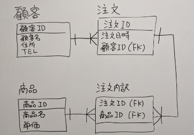

1. #### 논리설계의 구체적인 방법

   1. ##### 이것은 무엇을 하기위한 시스템인가를 생각해 중심이 되는 엔티티를 추출

      - 주문을 하기위한 시스템 -> 주문 엔티티

   2. ##### 5W1H를 생각해 중심이 되는 엔티티의 주변 엔티티를 발탁해낸다(見だす)

      - 누가 주문을 하는가 -> 고객 엔티티
      - 무엇을 주문하는가 -> 상품 엔티티
      - 언제 주문하는가 -> 주문일 엔티티

   3. ##### 인터터페이스(주문 폼)의 각 항목을 엔티티 속성으로 넣는다. 이외에도 인터페이스에 등장하진 않지만 관리하는 항목이라면 추가한다.

      1. 주문
         - 배달희망일
         - 수량
         - **주문연월일**
      2. 고객
         - 성명
         - 주소
         - 전화번호
      3. 상품
         - 상품명
         - 가격
      4. ~~주문일~~
         - ~~주문연월일~~

2. #### 주 키를 결정하는 구체적인 방법

   1. 주 키로서 적절한 컬럼이 존재하는가? 없다면 ID 등의 컬럼을 추가한다.	

      > 1. 주문
      >
      >    - **주문ID**
      >
      >    - 배달희망일
      >    - 수량
      >    - 주문연월일
      >
      > 2. 고객
      >
      >    - **고객ID**
      >
      >    - 성명
      >    - 주소
      >    - 전화번호
      >
      > 3. 상품
      >
      >    - **상품ID**
      >
      >    - 상품명

3. #### 외부 키의 설정과 정규화

   1. 외부 키의 설정
   
      > 1. 주문
      >    - **<u>주문ID</u>**
      >    - <u>고객ID</u>
      >    - ~~<u>상품ID</u>~~ **→ 복수의 상품을 구매한다면? 제1정규형 위반**
      >    - 배달희망일
      >    - ~~수량~~
      >    - 주문연월일
      > 2. 고객
      >    - <u>**고객ID**</u>
      >    - 성명
      >    - 주소
      >    - 전화번호
      > 3. 상품
      >    - <u>**상품ID**</u>
      >    - 상품명
      > 4. **주문 상품 내역**
      >    - **주문ID**
      >    - **상품ID**
      >    - **수량**

4. 논리설계 프로세스 정리
   1. 이것은 무엇을 하는 시스템인가 생각하고 중심이 되는 엔티티를 추출한다
   2. 5W1H를 생각해서 중심이 되는 엔티티의 주변 엔티티를 발탁한다
   3. 인터페이스에 있는 각 항목을 엔티티의 속성으로서 추가해간다.
   4. 주 키와 외부 키를 설정한다
   5. 엔티티와 속성을 테이블에 구현시켜 정규형을 충족하는지 확인한다.
   6. 필요한 엔티티가 모두 추출됐는지 불안해 할 지도 모르지만 제1정규형~제3정규형을 체크해가며 최종적으로 추출을 완료할 수 있기 때문에 너무 신경질적으로 추출할 필요는 없다.

