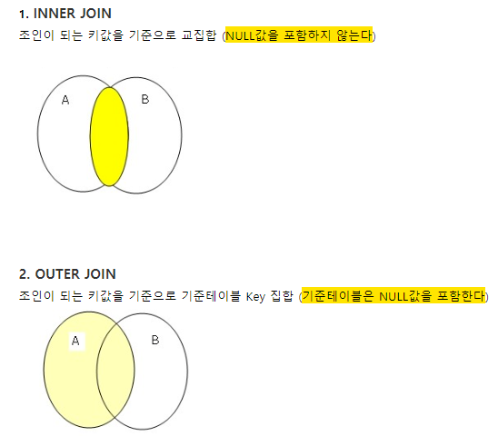

1. #### SQL의 3가지 기능

   1. 데이터 조작(Data Manipulation)
      - 테이블 **데이터**의 등록/수정/삭제/검색/복수의 표의 결합
      - DML
   2. 데이터 정의(Data Definition)
      - 테이블 데이터의 **구조**를 정의하거나 삭제
      - DDL
   3. 데이터 제어(Data Control)
      - 데이터베이스의 접근제어
      - DCL

2. #### 데이터 정의언어의 구성요소

   1. CREATE : 데이터베이스나 테이블을 작성

   2. DROP : 데이터베이스나 테이블을 삭제

   3. ALTER : 데이터베이스나 테이블의 구성을 변경

      ```
      웹에서 데이터베이스를 테스트 할 수 있는 환경
      http://sqlfiddle.com/
      ```

3. #### CREATE

   1. 작성법

      ```sql
      CREATE TABLE 테이블명
      (컬럼명1 데이터형 제약,
       컬럼명2 데이터형 제약,
       ...
       데이블의 제약1, 테이블의 제약2, ...);
      ```

   2. 작성 예

      ```sql
      CREATE TABLE Orders (	
          order_id INTEGER NOT NULL, 
      	order_date DATE NOT NULL,
      	client_id INTEGER NOT NULL,
      		PRIMARY KEY (order_id),
      		FOREIGN KEY (client_id) REFERENCES CLIENTS (client_id)
      );
      ```

   3. 명명 룰

      1. 테이블 이름에 사용할 수 있는 문자는 반각 **영숫자**와 **언더 바**
      2. 테이블 이름의 첫문자는 알파벳을 사용 (첫문자는 주로 대문자를 사용)
      3. 테이블 이름이 중복되어선 안됨

   4. 컬럼의 데이터 형

      1. INTEGER형

         - 정수(整数)를 넣는 열에 지정하는 데이터 형
         - 소수(小数)는 불가

      2. CHAR형

         - **고정길이 문자열**

         - 괄호(括弧)에는 최대 바이트 수를 지정한다. 지정한 바이트를 넘으면 에러가 발생.

           > char(8)

         - 고정길이이므로 길이에 부족한 부분은 말미에 **반각 스페이스**가 포함된다

           > char(8) : 'ABC' → 'ABC     '

      3. VARCHAR

         - **가변길이 문자열**을 지정하는 데이터형

         - CHAR와 똑같이 최대 문자수를 지정한다. 

           > VARCHAR(8)

         - VARCHAR(8)에 'ABC'를 저장하면 그대로 'ABC'가 저장된다.

      4. DATE형
         - 주로 연월일을 넣는 열에 지정하는 데이터 형

4. #### CHAR와 VARCHAR의 사용법 구분

   1. ##### char형

      - 우편번호, 전화번호 등 **최대 문자수가 명확**하고 값의 변경 가능성이 높을 때 사용.

   2. ##### varchar형

      - 결점
        - 데이터 용량이 늘어날 경우 데이터 디스크의 적재용량에 부담을 줄 수 있다. 
        - 데이터 용량이 늘어나서 여러 디스크에 나누어 저장하게되면 검색 속도가 저하된다.

      - 최대 문자수가 명확하지 않고 값의 변경 가능성이 낮을 때 사용
      - 대부분의 경우 char를 쓸지 varchar를 쓸지 고민될 정도라면 varchar를 써도 좋다

5. 제약
   1. 컬럼이나 테이블에 제약이나 조건을 추가하는 기능
   2. NOT NULL제약
      - NOT NULL : 테이터가 없는 상태를 용서하지 않는 제약
      - 사용자가 특정 컬럼에 대해 데이터가 없는 상태가 되지 않도록 주의하는 것이 아닌, 시스템상 제약을 걸어버리는 것이 가장 확실한 방법이다.
   3. 주 키 제약
   
      - 주 키제약은 테이블에 반드시 1개 필요하고 1개만 설정할 수 있다.
   
      - 주 키가 복수의 컬럼으로 구성되는 경우 아래와 같이 적는다
   
        ```
        PRIMARY KEY (컬럼1, 컬럼2, ...)
        ```
   
      - 주 키에 NULL이 포함되어서는 안되기 떄문에 모든 주 키는 NOT NULL 제약을 붙일 필요가 있다.
   
   4. 참조 무결성(整合性) 제약
   
      - 외부키를 설정할 수 있는 제약
   
        ```
        FOREIGN KEY (외부키)
        PREFERENCES 참조테이블 (참조컬럼)
        ```

6. 조인

   

7. DROP

   - 테이블을 삭제
   - 한번 삭제한 테이블은 복구할 수 없기 때문에 주의가 필요

8. ALTER

   - 이미 정의되어있는 테이블을 변경

   - 삭제나 변경은 안일하게 수행해서는 안된다.

     ```sql
     ALTER TABLE 테이블명 DROP COLUMN 컬럼명;
     ALTER TABLE 테이블명 ADD COLUMN 컬럼명 데이터형 [제약];
     ALTER TABLE 테이블명 RENAME TO 테이블명;
     ```

     